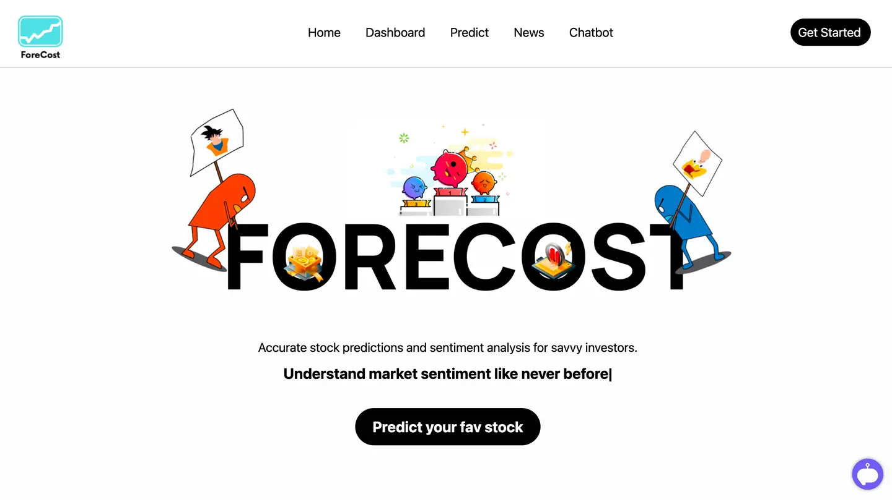
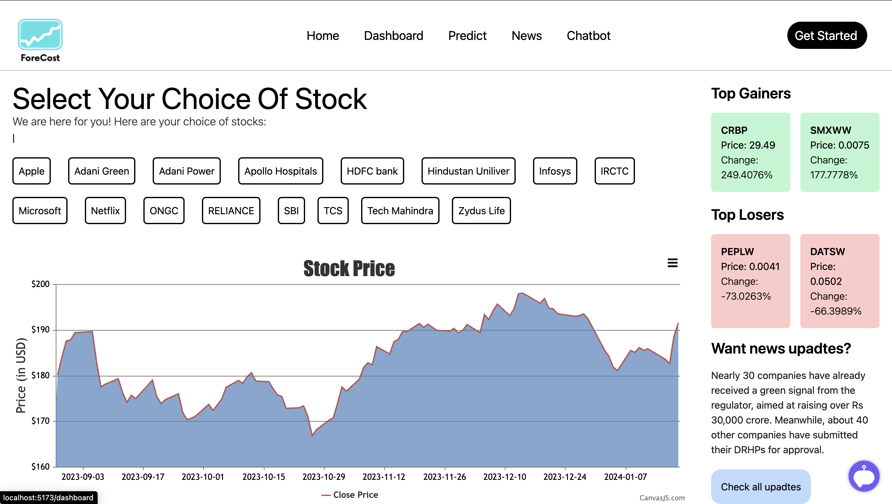
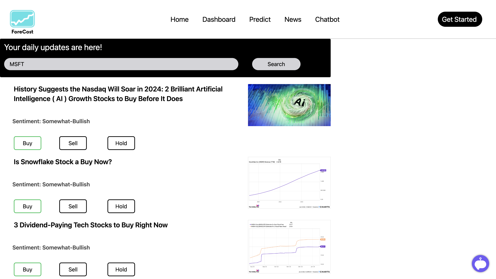
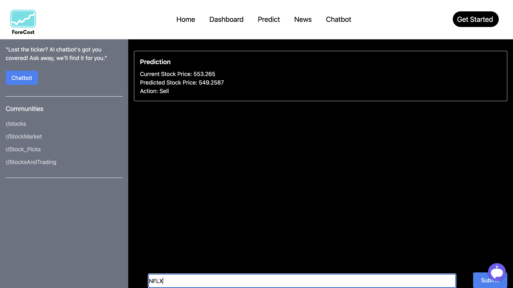
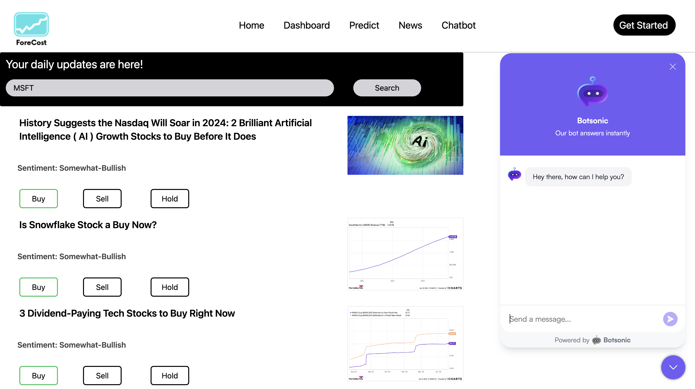

# DotSlash-7.0

#### Stock Predictor Web Application

This project is a web application that provides a platform for users to check cureent price of stocks,view stock predictions, news, and use chatbot for stock related queries. 

### Pages
- Landing Page This page contains the basic information about the application and the services it provides.
<!-- display landing page image  -->

-Then we have a dashboard Page in which first we display the graph of listed companies, on the right side we show the top gainers and losers of the day and then we give a redirection to news page for checking the sentiment analysis

- News Page This page contains the latest news and AI predictions for the stocks, for now you can search using tickers and we will show the news and predictions for that stock. It tells you sentiment of the news

- Predictor Page This page contains the future price of stocks, for now you can search using tickers and we will show the current price,future price and action to be taken.

- We have chatbot from botsonic embedded in the code which is a paid version so we can't show the chatbot here but it is working fine.

## Getting Started

To get started with this project, follow these steps:

1. Fork this repository to your GitHub account.
2. Clone the forked repository to your local machine.
3. Install the required dependencies by running `npm install`.
4. Change directory to frontend `cd frontend`, run the server as `npm run dev`
5. Open a new terminal, change the directory to `backend` , Run the development server by running `npm start`.
6) We have flask model in server.py file to run that you first need to install the required libraries by running 
`pip install -r requirements.txt` and then run the server by running 
`python3 -m flask --app server.py run --debug`

## Contributing

If you'd like to contribute to this project, please follow these guidelines.

1. Fork this repository to your GitHub account.
2. Clone the forked repository to your local machine.
3. Create a new branch for your feature or bugfix: `git checkout -b new-feature`.

4. Install the required dependencies by running `npm install`.
5. Change directory to frontend `cd frontend`, run the server as `npm run dev`
6. Open a new terminal, change the directory to `backend` , Run the development server by running `npm start`.
7) We have flask model in server.py file to run that you first need to install the required libraries by running
`pip install -r requirements.txt` and then run the server by running
`python3 -m flask --app server.py run --debug`

8. Make your changes and commit them to your branch.
9. Push your changes to your forked repository.
10. Open a pull request to this repository and describe the changes you made.
